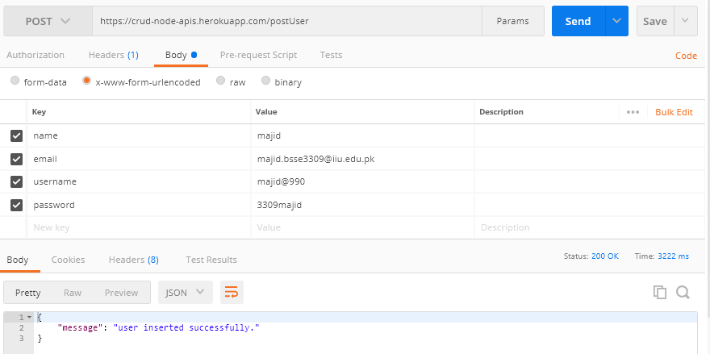
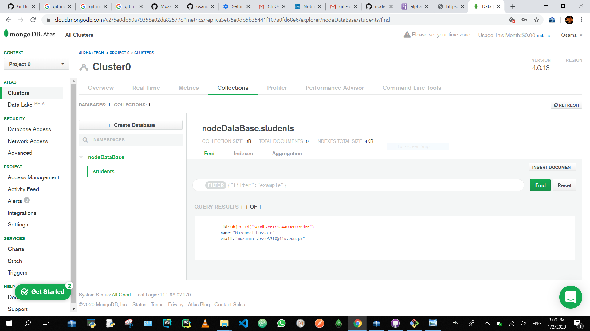
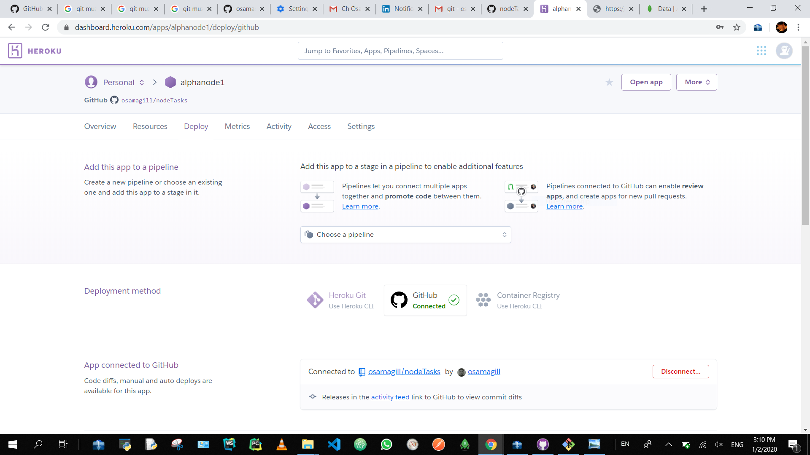

# Node API have following features.
<ul>
  <li>Create a new student.</li>
<li>Update Existing Student.</li>
<li>Read  a List of students OR single student by id.</li>
<li>Delete existing student.</li>
<li>login</li>
<li>signup</li>
</ul>

Connected with online cluster of mongodb.
<ul>
  <li>app is deployed in heroku.</li>
  <li>API have following endpoints.</li>
</ul>
<ol>
  Home Page of API
  <li><a href = "https://crud-node-apis.herokuapp.com/">https://crud-node-apis.herokuapp.com/</a></li>
  Get method to get All students.
  <li><a href = "https://crud-node-apis.herokuapp.com/getStudents">https://crud-node-apis.herokuapp.com/getStudents</a></li>
  Get method to get student by id.
  <li><a href = "https://crud-node-apis.herokuapp.com/{id}">https://crud-node-apis.herokuapp.com/{id}</a></li>
  Patch method to Update existing student by providing id of student.
  <li><a href = "https://crud-node-apis.herokuapp.com/{id}">https://crud-node-apis.herokuapp.com/{id}</a></li>
  Dlete method to Delete existing usetr by providing the id of student.
  <li><a href = "https://crud-node-apis.herokuapp.com/{id}">https://crud-node-apis.herokuapp.com/{id}</a></li>
</ol>  

 
Login the page
 
 
 

 
Post New Student
 
 
 

 
Online Database Cluster
 
 
 

 
Return list of students.
 
 

 
Heroku
 
 
